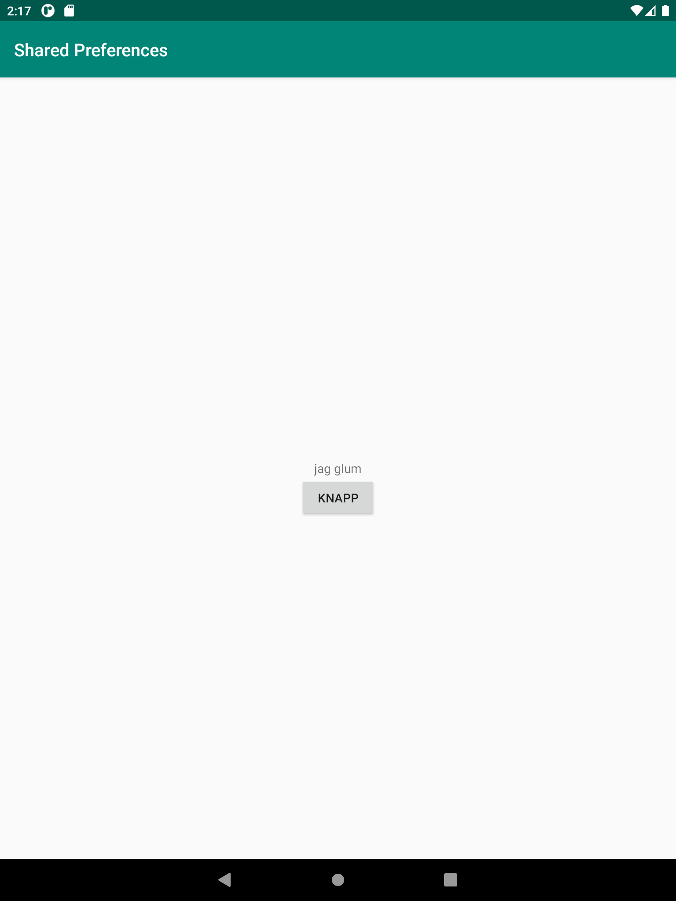
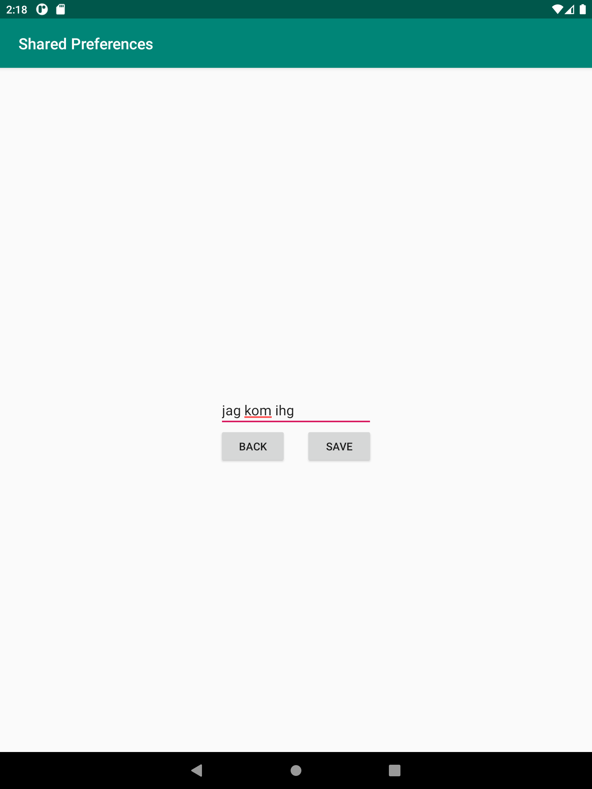

# Rapport

-In MainActivity: Read data from Shared Preferences
För att göra detta började jag med att skapa en TextView som ska innehålla datan. Därefter användes findViewById för att länka ihop tidigare skapad TextView
med den TextView som innehåller datan. Jag använde även getSharedPreferences för att få in data i MainAcitivty från SecondActivity.
Sedan användes preferences.getString intui void onResume för att visa den data som finns inuti "username".

```
    TextView showUsername;
    
    preferences = getSharedPreferences(("preferences"), MODE_PRIVATE);
    showUsername = findViewById(R.id.showUsername);
    
    @Override
    protected void onResume() {
        super.onResume();
        String username = preferences.getString("username", "jag glum");
        showUsername.setText(username);
    }
```


-Create a new screen called SecondActivity that can be opened from MainActivity
I förstahand skapades en ny aktivitet som döptes till "SecondActivity". Därefter skapades en Button i MainActivity. Sedan används findViewById för att variabeln ska tillhöra
rätt knapp. Sedan använde jag mig av en onClickListener som innehåller en Intent. Denna Intent innehåller "MainActivity.this, SecondActivity.class" för att skicka
användaren till "SecondActivity".

```
Button next;
next = findViewById(R.id.button);

next.setOnClickListener(new View.OnClickListener() {
@Override
public void onClick(View view) {
    Intent intent = new Intent(MainActivity.this, SecondActivity.class);
    startActivity(intent);
    }
});
```

-In SecondActivity: Write data to Shared Preferences using EditText
I förstahand la jag in en EditText genom design-vyn i activity_second.xml. Därefter skapades en EditText variabel som döptes till "setUsername" samt en SharedPreferences variabel.
Sedan användes en findViewById för att se till att setUsername läser av den EditText som finns i layouten. Sedan användes en getSharedPreferences. Därefter
användes en setOnClickListener. Inuti denna användes en Editor som håller koll på texten användaren skriver i den EditText som skapades tidigare.

```
    EditText setUsername;
    setUsername = findViewById(R.id.setUsername);
    ave.setOnClickListener(new View.OnClickListener() {
    @Override
    public void onClick(View view) {
        SharedPreferences.Editor editor = preferences.edit();
        editor.putString("username", setUsername.getText().toString());
        editor.apply();
        }
    });
```

-When closing SecondActivity the data written should be visible in MainActivity
I förstahand skapades en Button variabel som döptes till "save". Denna används för att kunna spara innehållet i den EditText som används. Därefter användes en findViewById för knappen.
För att sedan göra detta användes den save.setOnClickListener som tidigare nämndes. Denna setOnClickListener innehåller sedan 
SharedPreferences variabeln som gjordes tidigare. En Editor sätts sedan på SharedPreferences. Slutligen så används "editor.apply" för att spara innehållet i 
den SharedPreferences som finns och sedan förs vidare till MainActivity.

```
    Button save;
    save = findViewById(R.id.save);
            
    save.setOnClickListener(new View.OnClickListener() {
    @Override
    public void onClick(View view) {
            SharedPreferences.Editor editor = preferences.edit();
            editor.putString("username", setUsername.getText().toString());
            editor.apply();
            }
    });
```





